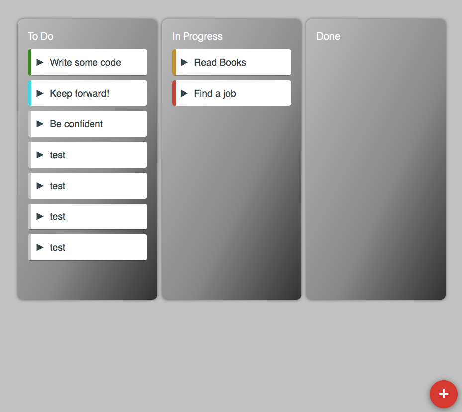

## 介绍
这是一个React看板APP，分为三个列表，功能类似于Trello。

## 技术栈
使用到的技术栈：

 1. React@15
 2. React-Router@1
 3. SCSS
 4. webpack@3

## 项目目录
react-kanban-app
├── README.md
├── package.json
├── webpack.config.js
├── .gitignore
├── **public**
│   └── favicon.ico
│   └── index.html
│   └── bundle.js <-------------------------output
│   └── style.scss
└── **src**
│   └── **scss**
 │   └── **components**
│   └── **routes**
│   └── **consts**
│   └── App.scss
│   └──  App.js
│   └── index.js			<-------------------------entry
│   └── logo.svg

## 工具&插件
请查看package.json文件。

## 使用
1. 克隆到本地
	```terminal
	git clone https://github.com/jasonwithjs/React-Kanban-App.git
	```

2. 本地启动
	- 使用yarn:
	```terminal
	    yarn install
	    yarn start
	```
	- 使用npm:

		```terminal
			npm install
			npm start
		```
		在浏览器中打开**[http://localhost:8080](http://localhost:8080)**。
3. 本地打包:
```terminal
    yarn build
```